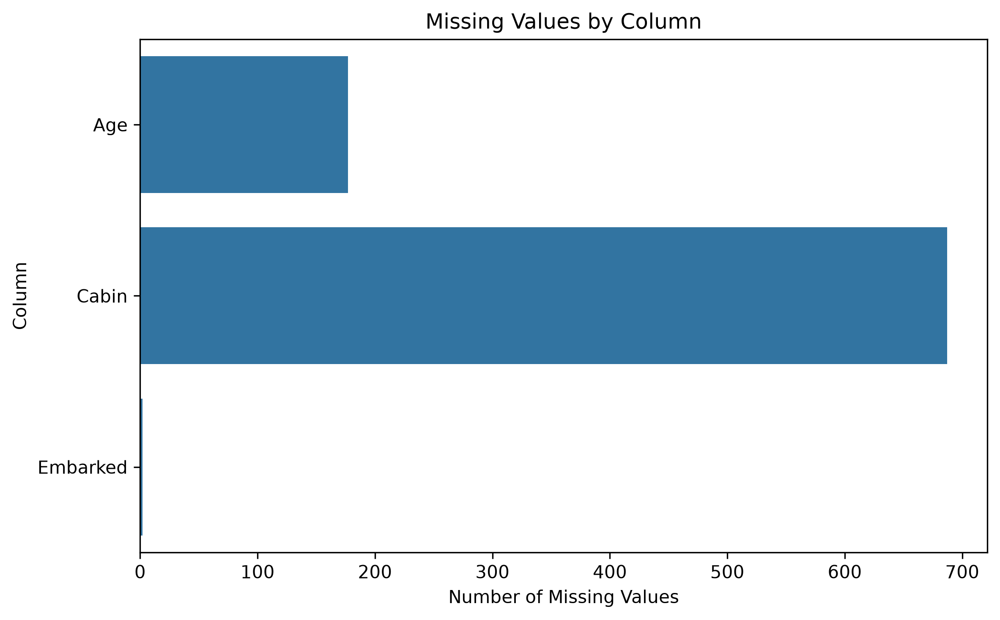
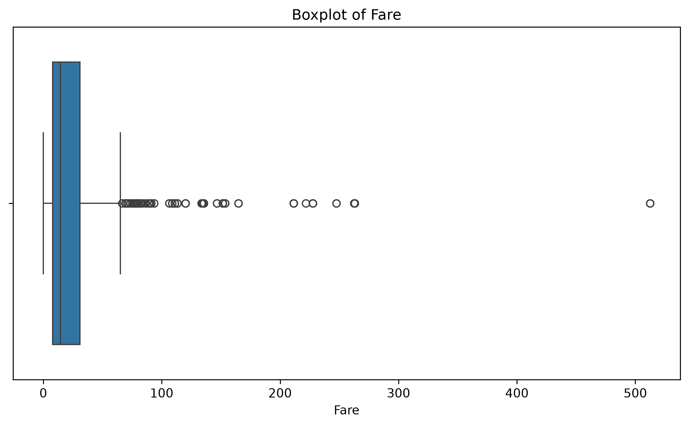
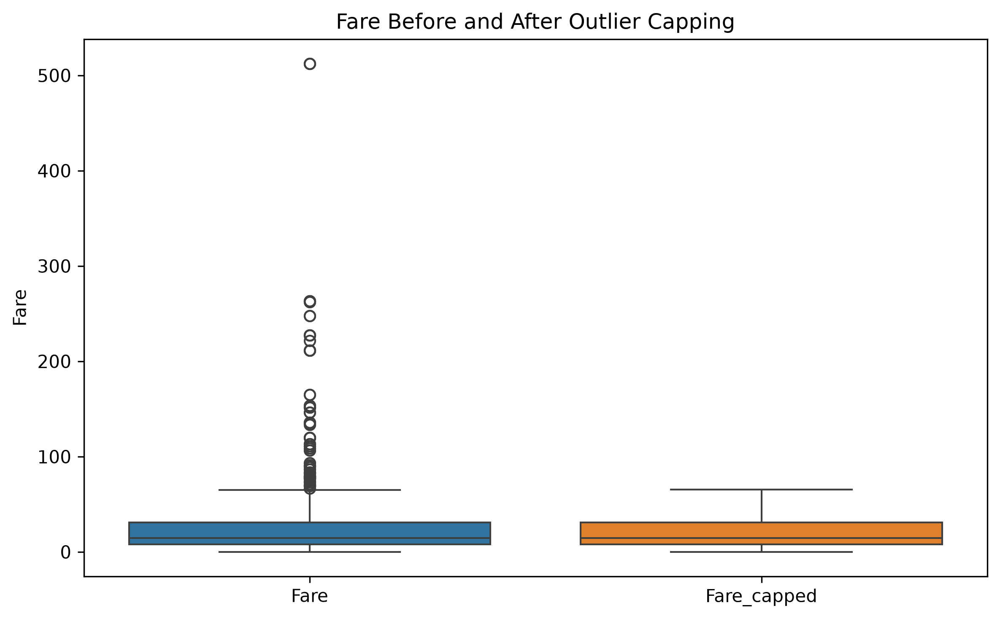
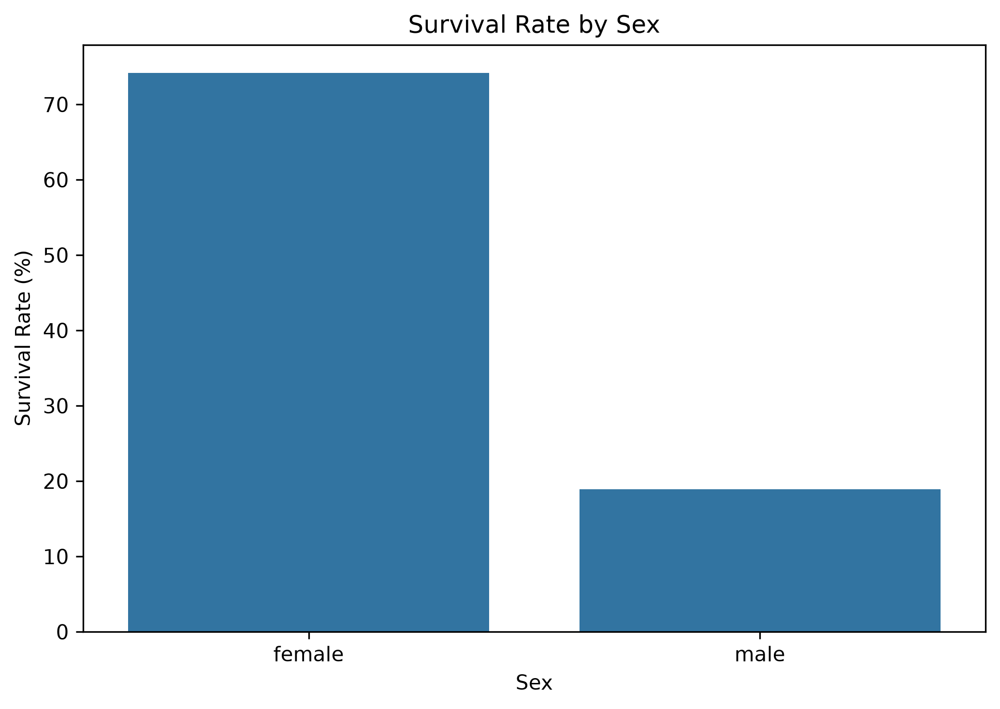
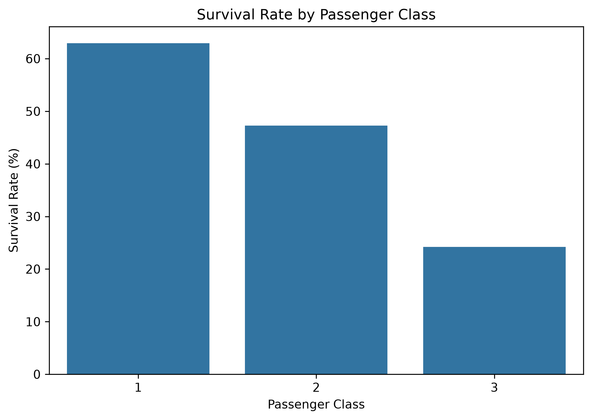
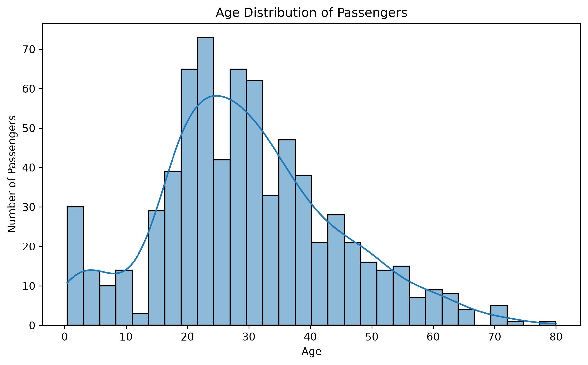
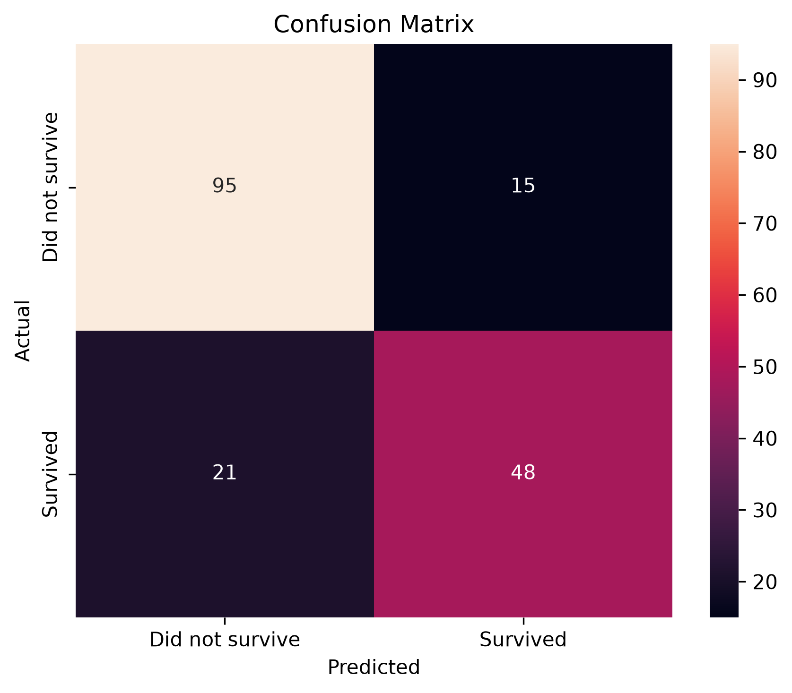

# Titanic Data Cleaning and Preprocessing

## Project Overview

This project focuses on cleaning and preprocessing the Titanic dataset from Kaggle's **Titanic - Machine Learning from Disaster** competition.

The objective of the project is to identify and handle missing values, detect potential outliers and inconsistencies, engineer useful features, and prepare the dataset for further data analysis and machine learning.

The project also demonstrates a complete preprocessing workflow using Python, Pandas, Matplotlib, Seaborn, and Scikit-learn. A Logistic Regression model is used as a downstream validation step to verify that the processed data can be successfully used in a machine learning pipeline.

## Dataset Information

The dataset used in this project is the **Titanic - Machine Learning from Disaster** dataset available on Kaggle.

For this project, the `train.csv` file was used because it contains both passenger information and the target variable `Survived`.

### Original Dataset Shape

- Rows: 891
- Columns: 12

### Columns in the Dataset

- `PassengerId` - Unique passenger identifier
- `Survived` - Survival status where 0 = No and 1 = Yes
- `Pclass` - Passenger class
- `Name` - Passenger name
- `Sex` - Gender of the passenger
- `Age` - Age of the passenger
- `SibSp` - Number of siblings/spouses aboard
- `Parch` - Number of parents/children aboard
- `Ticket` - Ticket number
- `Fare` - Passenger fare
- `Cabin` - Cabin number
- `Embarked` - Port of embarkation

### Missing Values Identified

The initial dataset contained missing values in the following columns:

- `Age` - 177 missing values
- `Cabin` - 687 missing values
- `Embarked` - 2 missing values

No duplicate rows were found in the original dataset.

## Data Cleaning and Preprocessing

The dataset was cleaned and preprocessed in several stages to improve its quality and make it suitable for further analysis and machine learning.

### 1. Handling Missing Values

#### Age
Missing values in the `Age` column were filled using the median age calculated within groups based on `Pclass` and `Sex`.

This approach was used instead of filling all missing ages with a single overall median because age distribution can vary across passenger classes and gender groups.

#### Embarked
The `Embarked` column had only 2 missing values. These were filled using the mode, which represents the most frequently occurring embarkation port.

#### Cabin
The `Cabin` column had a very large number of missing values. Instead of trying to guess missing cabin numbers, a new binary feature called `Cabin_known` was created:

- `1` - Cabin information is available
- `0` - Cabin information is missing

This preserves useful information about cabin availability without introducing artificial cabin values.

### 2. Outlier Analysis and Treatment

Potential outliers were identified using the Interquartile Range (IQR) method for:

- `Age`
- `Fare`
- `SibSp`
- `Parch`

The analysis showed that some values were statistically classified as outliers, but they were not automatically treated as errors because they could represent valid passenger information.

For the `Fare` column, extreme values were capped at the upper IQR boundary instead of deleting passenger records.

A new feature called `Fare_capped` was created while the original `Fare` column was retained.

### 3. Feature Engineering

Two additional features were created:

#### FamilySize

`FamilySize` was calculated using:

`FamilySize = SibSp + Parch + 1`

The additional `1` represents the passenger themself.

#### IsAlone

A binary feature called `IsAlone` was created from `FamilySize`:

- `1` - Passenger was travelling alone
- `0` - Passenger was travelling with family

### 4. Categorical and Numerical Preprocessing

A Scikit-learn preprocessing pipeline was used for machine learning preparation.

Numerical features were standardized using `StandardScaler`, while categorical variables such as `Sex` and `Embarked` were converted into numerical form using `OneHotEncoder`.

The preprocessing steps were combined using `ColumnTransformer` and `Pipeline` to create a structured and reproducible workflow.

## Exploratory Data Analysis and Visualizations

Several visualizations were created to better understand the dataset and support the cleaning decisions.

### Missing Values

A bar chart was created to visualize the number of missing values in each column.

The analysis showed that `Cabin` had the highest number of missing values, followed by `Age`, while `Embarked` contained only a small number of missing entries.



### Outlier Detection

Boxplots were created for the numerical columns `Age`, `Fare`, `SibSp`, and `Parch` to identify potential outliers.

These plots helped confirm that some extreme values existed, particularly in the `Fare` column.



### Fare Before and After Capping

A comparison boxplot was created to show the effect of capping extreme fare values at the upper IQR limit.



### Survival Rate by Sex

The survival rate differed significantly between male and female passengers.



### Survival Rate by Passenger Class

Passengers in first class had a higher survival rate compared with passengers in second and third class.



### Age Distribution

A histogram with a density curve was created to study the age distribution of passengers.



## Machine Learning Validation

After cleaning and preprocessing the dataset, a Logistic Regression model was used as a validation step to confirm that the prepared data could be successfully used in a machine learning workflow.

The dataset was divided into training and testing sets using an 80:20 split.

### Train-Test Split

- Training samples: 712
- Testing samples: 179

The split was performed using stratification to preserve the proportion of survival classes in both the training and testing datasets.

### Model Used

A `LogisticRegression` classifier was included inside the Scikit-learn pipeline.

The pipeline automatically:

- Standardized numerical features
- Encoded categorical features
- Applied the same preprocessing to the test data
- Trained the Logistic Regression model

### Model Accuracy

The final model achieved an accuracy of:

**79.89%**

### Classification Report

For passengers who did not survive:

- Precision: 0.82
- Recall: 0.86
- F1-score: 0.84

For passengers who survived:

- Precision: 0.76
- Recall: 0.70
- F1-score: 0.73

### Confusion Matrix

The confusion matrix obtained from the test dataset was:

| Actual / Predicted | Did Not Survive | Survived |
|---|---:|---:|
| Did Not Survive | 95 | 15 |
| Survived | 21 | 48 |

This means that the model correctly predicted 95 passengers who did not survive and 48 passengers who survived.



The machine learning model was used mainly as a downstream validation step. The primary objective of this project is data cleaning and preprocessing rather than maximizing predictive performance.

## Final Dataset Summary

After cleaning and feature engineering, the processed dataset contains:

- Rows: 891
- Columns: 16
- Missing values in final machine learning features: 0
- Duplicate rows: 0

The final features used for machine learning were:

- `Pclass`
- `Age`
- `SibSp`
- `Parch`
- `Fare_capped`
- `Cabin_known`
- `FamilySize`
- `IsAlone`
- `Sex`
- `Embarked`

The cleaned dataset is saved as:

`outputs/titanic_cleaned.csv`

## Project Structure

```text
Titanic_Data_Cleaning_Project/
│
├── data/
│   └── train.csv
│
├── outputs/
│   ├── titanic_cleaned.csv
│   └── figures/
│       ├── missing_values.png
│       ├── age_boxplot.png
│       ├── fare_boxplot.png
│       ├── sibsp_boxplot.png
│       ├── parch_boxplot.png
│       ├── fare_before_after.png
│       ├── survival_by_sex.png
│       ├── survival_by_class.png
│       ├── age_distribution.png
│       └── confusion_matrix.png
│
├── src/
│   ├── titanic_cleaning.py
│   └── titanic_cleaning_backup.py
│
├── pyproject.toml
├── uv.lock
└── README.md

## Technologies Used

The project was implemented using the following tools and libraries:

* Python
* Pandas
* Matplotlib
* Seaborn
* Scikit-learn
* uv for Python environment and dependency management
* Visual Studio Code
* Git and GitHub

## How to Run the Project

### 1. Clone the Repository

```bash
git clone https://github.com/ARraj14/Titanic_Data_Cleaning_Project.git
```

Move into the project directory:

```bash
cd Titanic_Data_Cleaning_Project
```

### 2. Install Dependencies

This project uses `uv` for dependency management.

Run:

```bash
uv sync
```

This will create the virtual environment and install the dependencies defined in `pyproject.toml` and `uv.lock`.

### 3. Dataset Setup

Download the **Titanic - Machine Learning from Disaster** dataset from Kaggle.

Place the `train.csv` file inside:

```text
data/train.csv
```

### 4. Run the Project

From the project root directory, execute:

```bash
uv run python src/titanic_cleaning.py
```

The script will:

* Load and inspect the dataset
* Analyze missing values
* Check for duplicates and inconsistencies
* Detect potential outliers
* Perform data cleaning
* Engineer new features
* Generate visualizations
* Train and evaluate a Logistic Regression model
* Save the cleaned dataset

The cleaned dataset will be saved as:

```text
outputs/titanic_cleaned.csv
```

Generated plots will be stored inside:

```text
outputs/figures/
```

## Challenges and Solutions

### Handling Missing Age Values

One challenge was deciding how to handle the large number of missing values in the `Age` column.

Instead of using a single overall mean or median, missing ages were filled using the median within groups based on passenger class and sex. This helped preserve more information about differences between passenger groups.

### Handling Missing Cabin Information

The `Cabin` column contained 687 missing values, making direct imputation unreliable.

Rather than generating artificial cabin numbers, a new binary feature called `Cabin_known` was created to represent whether cabin information was available.

### Handling Fare Outliers

The `Fare` column contained several values identified as statistical outliers using the IQR method.

These records were not deleted because high fares could represent legitimate first-class or group ticket purchases. Instead, a separate `Fare_capped` feature was created by limiting extreme values to the upper IQR boundary.

### Understanding Statistical Outliers

Another important challenge was distinguishing between a statistical outlier and an incorrect value.

Values identified by the IQR method were investigated before making cleaning decisions. Values such as high ages, large family sizes, and high fares were not automatically removed because they could still represent valid passengers.

### Preventing Inconsistent Preprocessing

Scikit-learn's `Pipeline` and `C
